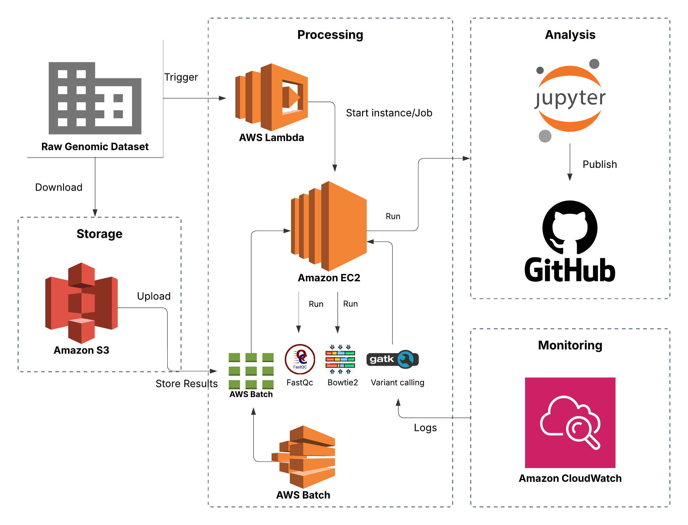

# 🧬 Bioinformatics Pipeline on AWS

This project implements an end-to-end **bioinformatics workflow** for processing genomic data using **AWS Cloud Services**.  
It takes raw sequencing data (FASTQ), performs:

- 🧪 Quality control (FastQC)  
- 🎯 Read alignment (Bowtie2 or BWA)  
- 🧬 Variant calling (GATK)  
- 📊 Data analysis (Jupyter Notebook)

It runs on **EC2**, stores data in **Amazon S3**, and optionally automates/parallelizes tasks via **AWS Lambda** and **AWS Batch**.

---

## 📁 Project Structure

```
bioinformatics-pipeline-aws/
│
├── data/                      # Sample genomic data
│
├── pipeline/
│   ├── install_tools.sh       # Script to install bioinformatics tools
│   ├── run_pipeline.sh        # Main shell script to run the pipeline
│   └── analysis/
│       ├── fastqc_reports/
│       ├── sam_files/
│       └── bam_files/
│
├── docs/
│   └── aws_architecture_diagram.png  # AWS architecture diagram
│
├── scripts/
│   ├── s3_upload.sh           # Upload results to S3
│   └── jupyter_analysis.py    # Analysis notebook for results
│
└── README.md
```

---

## 🚀 Features

- ✅ Quality checks using **FastQC**  
- ✅ Read alignment using **Bowtie2** or **BWA**  
- ✅ Alignment file processing with **Samtools**  
- ✅ Variant calling using **GATK**  
- ✅ Uploading data/results to **Amazon S3**  
- ✅ Visualization & analysis in **Jupyter Notebook**  
- ✅ Cloud-native design using **EC2**, **S3**, **Lambda**, and **AWS Batch**

---

## 🔧 Prerequisites

- AWS account with access to EC2, S3, Lambda, and Batch  
- An EC2 instance (Ubuntu preferred, `t2.medium` or higher)  
- SSH access (e.g., PuTTY or native SSH on Windows)  
- Tools installed using `install_tools.sh`  

---

## ⚙️ Setup Guide

### 1️⃣ Clone the Repository

```bash
git clone https://github.com/yourusername/bioinformatics-pipeline-aws.git
cd bioinformatics-pipeline-aws
```

---

### 2️⃣ Upload Genomic Data to S3

Use the AWS CLI to upload your input files to S3:

```bash
aws s3 cp ~/Downloads/raw_data/ s3://your-bucket-name/raw_data/ --recursive
```

---

### 3️⃣ Launch EC2 Instance

Use **Ubuntu** as the base AMI.  
Connect via SSH:

- Windows users: Use **PuTTY**
- Linux/macOS/WSL users: Use the native `ssh` command

---

### 4️⃣ Install Tools on EC2

```bash
cd pipeline
bash install_tools.sh
```

---

### 5️⃣ Run the Bioinformatics Pipeline

```bash
bash run_pipeline.sh
```

This script will:

- Run FastQC for quality control  
- Align reads to reference genome  
- Convert SAM to BAM  
- Call variants using GATK  

---

### 6️⃣ Upload Results to S3

```bash
cd ../scripts
bash s3_upload.sh
```

---

## 📊 Analyze Results in Jupyter

1. Launch Jupyter on your EC2 instance (or locally):

```bash
pip3 install jupyter pandas matplotlib
jupyter notebook
```

2. Open `jupyter_analysis.py`  
3. Run each cell to load and visualize the `.vcf` results.

---

## ☁️ AWS Architecture

```
[S3: Stores data] <--> [EC2: pipeline + Jupyter]
         |
     [Lambda / Batch] (optional automation & scaling)
```

For a visual overview, see `docs/aws_architecture_diagram.png`.


---

## 🙌 Acknowledgements

- [NCBI SRA](https://www.ncbi.nlm.nih.gov/sra)  
- [1000 Genomes Project](https://www.internationalgenome.org/)  
- [GATK Toolkit](https://gatk.broadinstitute.org/)  
- [Amazon Web Services](https://aws.amazon.com/free) – AWS Free Tier  
